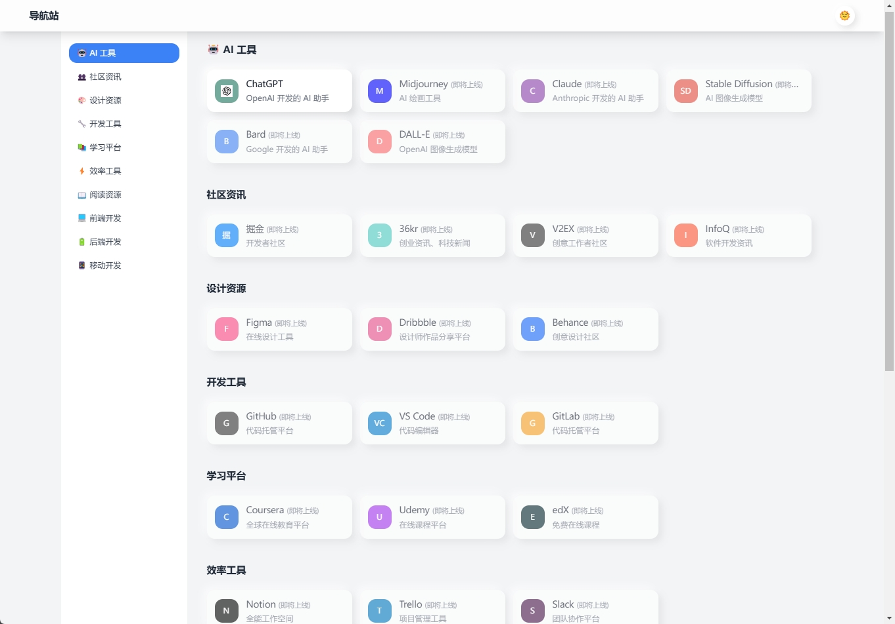
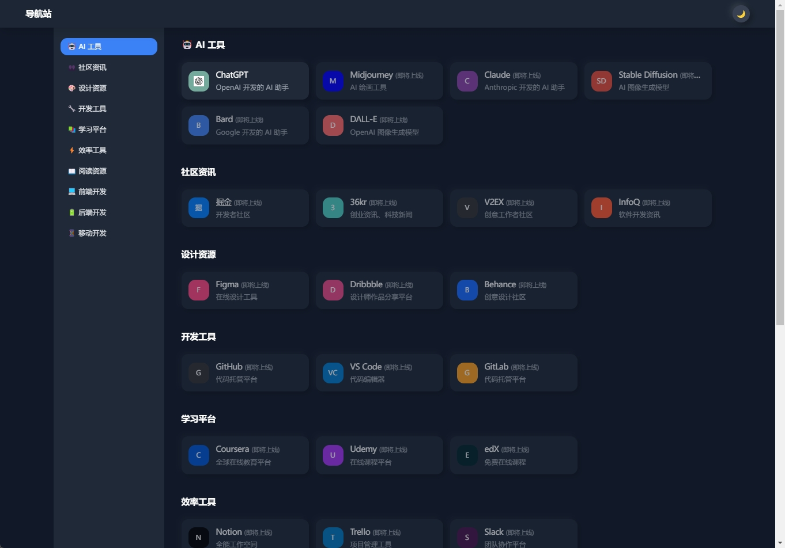
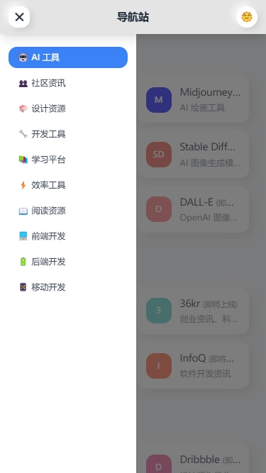
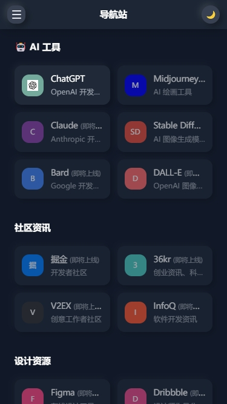

# Navify

🌟 Navify 是一款独特的导航网站应用，采用现代拟态设计（Neumorphism）风格，将简约优雅与实用性完美结合。基于 Vue 3 和 TailwindCSS 构建，带来流畅的交互体验和精致的视觉享受。

<p align="center">   <em>🎨 一个充满美感的现代化导航网站应用</em> </p>  <p align="center">   <a href="#预览">预览</a> •   <a href="#特性">特性</a> •   <a href="#安装">安装</a> •   <a href="#使用方法">使用方法</a> </p>

## 预览

### 桌面端预览
| 浅色模式 | 深色模式 |
|:---:|:---:|
|  |  |

### 移动端预览
| 浅色模式 | 深色模式 |
|:---:|:---:|
|  |  |

## 特性

- 🌓 支持亮色/暗色主题切换
- 🎨 优雅的 UI 设计和流畅的动画效果
- 📱 完全响应式设计，支持移动端和桌面端
- 🔍 智能的网站图标获取系统
- 🎯 平滑滚动和导航定位
- 🎭 自动跟随系统主题
- 📊 分类展示和组织网站链接
- 🚀 高性能和优化的用户体验

## 技术栈

- Vue 3 (Composition API)
- Nuxt.js
- TailwindCSS
- JavaScript

## 安装

```bash
# 克隆项目
git clone https://github.com/SunSeekerX/navify_nuxtjs.git

# 安装依赖
yarn

# 启动开发服务器
yarn dev

# 构建生产版本
cp .env.example .env.production
yarn build
```

## 使用方法

### 配置导航数据

在 `assets/constant.js` 中配置默认的导航数据：

```javascript
export const defaultCategories = [
  {
    id: "1",
    name: "分类1",
    // ...
  }
]

export const defaultSections = [
  {
    id: "1",
    title: "分类1",
    items: [
      {
        name: "网站名称",
        description: "网站描述",
        url: "https://example.com",
        color: "#666666"
      }
    ]
  }
]
```

### API 集成

应用支持通过 API 获取导航数据，接口返回格式：

```javascript
{
  code: 200,
  data: [
    {
      id: 1,
      name: "分类名称",
      sort: 1,
      items: [
        {
          name: "网站名称",
          description: "网站描述",
          url: "https://example.com",
          color: "#666666"
        }
      ]
    }
  ]
}
```

## 功能详解

### 主题切换

- 支持手动切换亮色/暗色主题
- 自动跟随系统主题设置
- 主题选择会被保存在 localStorage 中

### 响应式设计

- 移动端自适应布局
- 侧边栏响应式收缩
- 网格布局自动适应屏幕宽度

### 网站图标获取

- 自动获取网站 favicon
- 多个备选图标源
- 加载失败显示网站名称缩写

## 贡献

欢迎提交 Issue 和 Pull Request。

## 许可

MIT License
